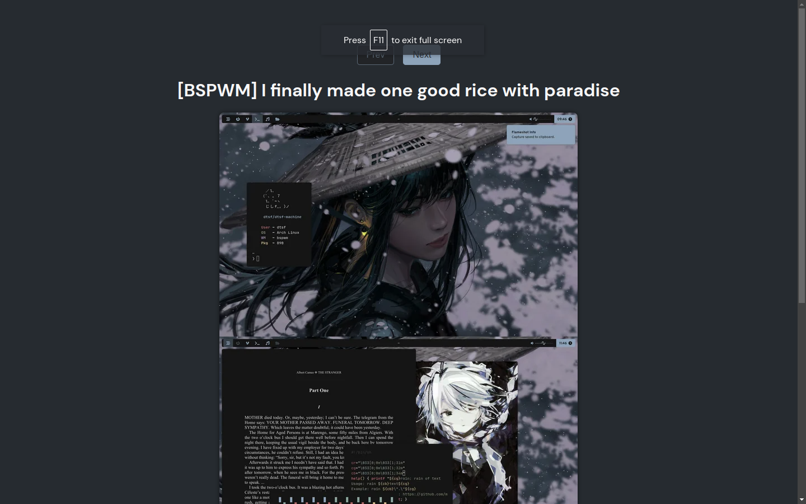

# My "Rices"

 
 

 

## How to Run the Project

1. Clone this repository: `git clone https://github.com/datsfilipe/readme-generator.git`.
2. Open the project folder in the terminal.
3. Run `pnpm install` to install the dependencies (or use your preferred package manager).
4. Run `pnpm dev` to start the application in a development environment on `http://localhost:5173`.

## How to Contribute

Follow these steps to contribute to the project:

1. Fork the repository.
2. Create a new branch: `git checkout -b feature-branch-name`.
3. Make your changes and commit them: `git commit -m 'Add some feature'`.
4. Push to the branch: `git push origin feature-branch-name`.
5. Open a pull request.

Please ensure that your code adheres to the project's coding standards.

## Contributors

<table>
    <tr>
        <td align="center">
            <a href="https://github.com/datsfilipe">
                 
                
                    <b>Filipe Lima</b>
                
            </a>
        </td>
    </tr>
</table>

## License

This project is licensed under the [MIT License](LICENSE).
